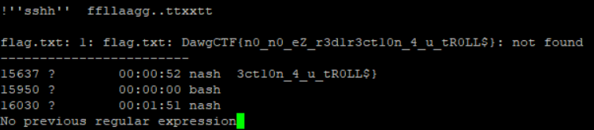
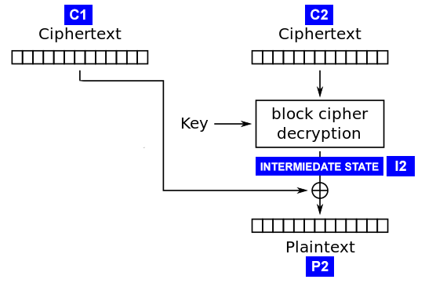

    # Potentially Eazzzy

Нам дан питоновский файл. Задачей этого скрипта является проверка лицензий. Его можно просмотреть его [здесь](potentially-eazzzy.py).
Похоже, что этот скрипт использует электронную почту в проверке лицензии. В этом есть смысл. Таким образом, никто не сможет использовать одну и ту же лицензию с двумя разными почтами.

Чтобы решить этот таск, нам придется разреверсить этот скрипт.

```python
def main():
    print("Welcome to Flag Generator 5000")
    print()
    print("Improving the speed quality of CTF solves since 2020")
    print()
    print("You'll need to have your email address and registration key ready.")
    print("Please note the support hotline is closed for COVID-19 and will be")
    print("unavailable until further notice.")
    print()

    email = input("Please enter your email address: ")
    key = input("Please enter your key: ")
```

Первым делом он приветствует пользователя. Затем он запрашивает у пользователя электронную почту и флаг и сохраняет эти входные данные в виде строк.

```python
if validate(email, key):
    print_flag()
else:
    print("License not valid. Please contact support.")
```

Затем он проверяет лицензию, вызывая `validate (email, key)`, и затем печатает флаг, если функция возвращает `True`. Пока все понятно.

Посмотрим на функцию `validate()`.

```python
def validate(email, key):
    email = email.strip()
    key = key.strip()
```

В начале он убирает все "пустые" символы.

```python
if len(key) != 32:
    return False
```

Затем он проверяет, имеет ли длина ключа 32 символа. Если ключ не такой длины, функция возвращает False, а это не то, что нам нужно. Чтобы напечатать флаг, функция должна вернуть `True`. Следовательно, длина ключа должна быть 32 символа.

```python
email = email[:31].ljust(31, "*")
email += "*"
```

Затем оно усекает письмо до 31 символа, а если оно меньше 31 символа, остальное заполняется звездами. Наконец, он добавляет одну последнюю звездочку в конец строки, в общей сложности 32 символа.

```python
for c in itertools.chain(email, key):
    if c not in ALPHABET:
        return False
```

Значение `ALPHABET` определяется в начале скрипта. Он содержит список символов в диапазоне от 0x2a-0x7a.

```python
ALPHABET = [chr(i) for i in range(ord("*"), ord("z")+1)]
```

Таким образом, эта часть проверяет, являются ли и электронная почта, и ключ «алфавитными», где «алфавитный» означает в диапазоне ASCII 0x2a-0x7a.

После этого существует множество ограничений, которым должны подчиняться электронная почта и лицензия.

```python
if email.count("@") != 1:
    return False
```

Мыло должно содержать хотя бы 1 собаку.

```python
if key[0] != "Z":
    return False
```

Первая буква лицензии должна быть Z.

```python
dotcount = email.count(".")
if dotcount < 0 or dotcount >= len(ALPHABET):
    return False
```

В письме должно быть от 0 до 80 точек. (не спрашивайте меня почему, так как в письме уже 32 символа)

Реализуем все это в [этом скрипте](sol.py), чтобы сгенерировать лицензию для нас, не будем делать это вручную. Подробнее об этом позже.

Затем идут сумасшедшие проверки. Тот, кто написал это, явно использовал скрипт для написания этой части:

```python
if a(dotcount) != o(key[1]):
    return False

if o(key[3]) != a(o(key[1])%30 + o(key[2])%30) + 5:
    return False

if o(key[2]) != a(indexes(email, "*") + 7):
    return False

if o(key[4]) != a(sum(o(i) for i in email)%60 + o(key[5])):
    return False

if o(key[5]) != a(o(key[3]) + 52):
    return False

if o(key[6]) != a((o(key[7])%8)*2):
    return False

if o(key[7]) != a(o(key[1]) + o(key[2]) - o(key[3])):
    return False

if o(key[8]) != a((o(key[6])%16) / 2):
    return False

if o(key[9]) != a(o(key[6]) + o(key[4]) + o(key[8]) - 4):
    return False

if o(key[10]) != a((o(key[1])%2) * 8 + o(key[2]) % 3 + o(key[3]) % 4):
    return False

if not m(email[3], key[11], key[12], 8):
    return False
if not m(email[7], key[13], key[4], 18):
    return False
if not m(email[9], key[14], key[3], 23):
    return False
if not m(email[10], key[15], key[10], 3):
    return False
if not m(email[11], key[13], key[16], 792):
    return False
if not m(email[12], key[17], key[4], email.count("d")):
    return False
if not m(email[13], key[18], key[7], email.count("a")):
    return False
if not m(email[14], key[19], key[8], email.count("w")):
    return False
if not m(email[15], key[20], key[1], email.count("g")):
    return False
if not m(email[16], email[17], key[21], email.count("s")):
    return False
if not m(email[18], email[19], key[22], email.count("m")):
    return False
if not m(email[20], key[23], key[17], 9):
    return False
if not m(email[21], key[24], key[13], 41):
    return False
if not m(email[22], key[25], key[10], 3):
    return False
if not m(email[23], key[26], email[14], email.count("1")):
    return False
if not m(email[24], email[25], key[27], email.count("*")):
    return False
if not m(email[26], email[27], key[28], 7):
    return False
if not m(email[28], email[29], key[29], 2):
    return False
if not m(email[30], key[30], email[18], 4):
    return False
if not m(email[31], key[31], email[4], 7):
    return False

return True
```
Либо так, либо автору потребовалось много времени и усилий, чтобы написать этот таск!

В любом случае, нам нужно знать о трех функциях, определенных в начале файла:

```python
a = lambda c: ord(ALPHABET[0]) + (c % len(ALPHABET))

o = lambda c: ord(c)

oa = lambda c: a(o(c))
```

Все они лямбда-функции, которые принимают один параметр.

`o ('Z')` просто сокращенно от `ord ('Z')`

`a(126)` - это еще одна функция, которая используется для преобразования любого числа в печатный символ, получая остаток от ввода по модулю длины `ALPHABET`, а затем добавляя ord первого символа в ` ALPHABET`. Он действительно возвращает `ord` печатного символа и используется для сравнения с символами в лицензии, чтобы проверить, действительна ли лицензия.

И, наконец, `oa ()` - это просто комбинация обеих функций.

Перво-наперво:

```python
if a(dotcount) != o(key[1]):
    return False
```

Здесь показано, что `a ()` от числа точек электронной почты должно быть равно `ord()` от второй буквы лицензии.

Изучая внутреннюю работу этой программы, делаем свой собственный скрипт, который можно было бы использовать для генерации лицензии по электронной почте. Как уже говорили, можно посмотреть на него [здесь](sol.py). Создаем массив с именем `key` для хранения всех кодов ключей лицензии.

```python
key = [ord('A')] * 32 ## contains ascii codes for the key, the key is 32 characters long.
```

Будем хранить символы таким образом, потому что строки неизменяемы, и можно изменить отдельные символы лицензии, как нам будет угодно.

Теперь можно отредактировать второй символ лицензии, используя эту проверку. Зная, что второй символ, представленный как целое число, должен быть равен `a (dotcount)`, можно просто сделать это:

```python
key[1] = a(dotcount)
```

И теперь это условие:

```python
if a(dotcount) != o(key[1]):
    return False
```

...выполняется.

Теперь можно обработать следующее условие:

```python
if o(key[3]) != a(o(key[1])%30 + o(key[2])%30) + 5:
    return False
```

...Поскольку значение `key [3]` зависит от значения `key [2]`, поэтому я должен сначала получить `key [2]`, что довольно просто.

```python
if o(key[2]) != a(indexes(email, "*") + 7):
    return False
```

...Следующим проверяется `key [2]`, поэтому теперь мы можем получить `key [2]` так:

```python
key[2] = a(indexes(email, "*") + 7)
```

Теперь, когда у нас есть `key [2]`, мы можем получить `key [3]`

```python
key[3] = a(key[1]%30 + key[2]%30) + 5
```

И мы можем продолжать идти тем же путем, что и раньше. Переходим к следующему куску. Если он зависит от другой части лицензии, сначала рассчитаем эту часть.

```python
if o(key[4]) != a(sum(o(i) for i in email)%60 + o(key[5])):
    return False

if o(key[5]) != a(o(key[3]) + 52):
    return False
```

`key [4]` зависит от `key [5]`, а `key [5]` зависит от `key [3]`. У нас уже есть `key [3]`, поэтому мы можем пойти дальше и получить `key [5]`. Тогда мы получим `key [4]`

```python
key[5] = a(key[3] + 52) ## the order of key calculation matters, because the value of key[4] depends on key[5].

key[4] = a(sum(o(i) for i in email)%60 + key[5])
```

Так продолжается до тех пор, пока мы не встретим `key [10]`

```python
key[7] = a(key[1] + key[2] - key[3])

key[6] = a((key[7]%8)*2)

key[8] = a((key[6]%16) / 2)

key[9] = a(key[6] + key[4] + key[8] - 4)

key[10] = a((key[1])%2 * 8 + key[2] % 3 + key[3] % 4)
```

Далее становится более сложным. Мы знакомимся с новой функцией `m ()`

```python
def m(one, two, three, four):
    d = len(ALPHABET)//2
    s = ord(ALPHABET[0])
    s1, s2, s3 = o(one) - s, o(two) - s, o(three) - s
    return sum([s1, s2, s3]) % d == four % d
```

Оно берет 4 параметра. Отредактируем функцию в скрипте, чтобы ее было легче понять.

```python
def m(one, two, three, four):
    d = 40
    s = 42
    s1, s2, s3 = one - 42, two - 42, three - 42
    return sum([s1, s2, s3]) % 40 == four % 40
```

Она принимает параметры с 1 по 3 и вычитает из них 42. Затем она проверяет, сравнима ли сумма этих трех чисел, которые мы только что рассчитали, четвертому параметру по модулю 40.

Вопрос в том, как мы можем перепроектировать это?

Давайте посмотрим на пример того, как он используется:

```python
if not m(email[3], key[11], key[12], 8):
    return False
```

Для того чтобы эта проверка прошла, вызываемая функция `m ()` должна возвращать `True`

После некоторых проб и ошибок получаем это:

```python
def l(two, three, four):
    one = ((sum([two, three]) + (-42 * 3)) % 40) - (four % 40)
    while one > 0:
        one = one - 40
    one = -one
    while one < 0x2a:
        one += 40
    return one
```

Нам удалось создать функцию, которая получает `one`, когда ей передают ` two`, `three` и ` four`.

Другими словами, при условии, что у вас есть `two`,` three` и `four`,` m (l (two, three, four), two, three, four) ` всегда будет возвращать `True`

Также помним, что все символы должны находиться в диапазоне ASCII `0x2a-0x7a`, поэтому добавляем 40 к каждому символу, пока он не будет попадать в этот интервал.

```python
one = l(two, three, four)

print(m(one, two, three, four)) ## Always will return True
```

Мы можем делать то же самое, что мы делали, но теперь мы можем использовать `l ()`, чтобы найти обратное к `m ()`. Порядок первых трех параметров не имеет значения. Круто, да?

Вот быстрый пример:

```python
if not m(email[3], key[11], key[12], 8):
    return False
```

Хм ... У нас нет ни `key [11]`, ни `key [12]`. Давайте продолжим.

```python
if not m(email[7], key[13], key[4], 18):
    return False
```

В нашем скрипте `email` определенно является строкой. Давайте это исправим.

```python
oldEmail = email[:]
email = []

for i in oldEmail:
    email.append(ord(i))
```

Теперь `email` - это список символьных значений ASCII, чего мы и хотим.
Поскольку у нас есть `key [4]` и `email [7]`, мы можем получить `key [13]`!

```python
key[13] = l(email[7], key[4], 18)
```

Отлично! Давайте продолжим делать это для остальных ключей.

```python
if not m(email[3], key[11], key[12], 8):
    return False
if not m(email[7], key[13], key[4], 18):
    return False
if not m(email[9], key[14], key[3], 23):
    return False
if not m(email[10], key[15], key[10], 3):
    return False
if not m(email[11], key[13], key[16], 792):
    return False
if not m(email[12], key[17], key[4], email.count("d")):
    return False
if not m(email[13], key[18], key[7], email.count("a")):
    return False
if not m(email[14], key[19], key[8], email.count("w")):
    return False
if not m(email[15], key[20], key[1], email.count("g")):
    return False
if not m(email[16], email[17], key[21], email.count("s")):
    return False
if not m(email[18], email[19], key[22], email.count("m")):
    return False
if not m(email[20], key[23], key[17], 9):
    return False
if not m(email[21], key[24], key[13], 41):
    return False
if not m(email[22], key[25], key[10], 3):
    return False
if not m(email[23], key[26], email[14], email.count("1")):
    return False
if not m(email[24], email[25], key[27], email.count("*")):
    return False
if not m(email[26], email[27], key[28], 7):
    return False
if not m(email[28], email[29], key[29], 2):
    return False
if not m(email[30], key[30], email[18], 4):
    return False
if not m(email[31], key[31], email[4], 7):
    return False
```

После того, как мы закончим, это должно выглядеть примерно так:

```python
#    if not m(email[16], email[17], key[21], email.count("s")): ## I will just start with this
#        return False

    key[21] = l(email[16], email[17], oldEmail.count('s'))

#    if not m(email[7], key[13], key[4], 18):
#        return False

    key[13] = l(email[7], key[4], 18)

#    if not m(email[11], key[13], key[16], 792):
#        return False

    key[16] = l(email[11], key[13], 792)

#    if not m(email[21], key[24], key[13], 41):
#        return False

    key[24] = l(email[21], key[13], 41)

#    if not m(email[9], key[14], key[3], 23):
#        return False

    key[14] = l(email[9], key[3], 23)

#    if not m(email[10], key[15], key[10], 3):
#        return False

    key[15] = l(email[10], key[10], 3)

#    if not m(email[12], key[17], key[4], email.count("d")):
#        return False

    key[17] = l(email[12], key[4], oldEmail.count('d'))

#    if not m(email[20], key[23], key[17], 9):
#        return False

    key[23] = l(email[20], key[17], 9)

#    if not m(email[31], key[31], email[4], 7):
#        return False

    key[31] = l(email[31], email[4], 7)

#    if not m(email[13], key[18], key[7], email.count("a")):
#        return False

    key[18] = l(email[13], key[7], oldEmail.count('a'))

#    if not m(email[30], key[30], email[18], 4):
#        return False1

    key[30] = l(email[30], email[18], 4)

#    if not m(email[28], email[29], key[29], 2):
#        return False

    key[29] = l(email[28], email[29], 2)

#    if not m(email[26], email[27], key[28], 7):
#        return False

    key[28] = l(email[26], email[27], 7)

#    if not m(email[3], key[11], key[12], 8):
#        return False

    key[11] = ord('Z') # idk
    key[12] = l(email[3], key[11], 8)

#    if not m(email[14], key[19], key[8], email.count("w")):
#        return False

    key[19] = l(email[14], key[8], oldEmail.count('w'))


#    if not m(email[15], key[20], key[1], oldEmail.count("g")):
#        return False

    key[20] = l(email[15], key[1], oldEmail.count('g'))

#    if not m(email[18], email[19], key[22], oldEmail.count("m")):
#        return False

    key[22] = l(email[18], email[19], oldEmail.count('m'))

#    if not m(email[22], key[25], key[10], 3):
#        return False

    key[25] = l(email[22], key[10], 3)

#    if not m(email[23], key[26], email[14], oldEmail.count("1")):
#        return False

    key[26] = l(email[23], email[14], oldEmail.count('1'))

#    if not m(email[24], email[25], key[27], oldEmail.count("*")):
#        return False

    key[27] = l(email[24], email[25], oldEmail.count('*'))
```

И мы сделали! Теперь мы пришли к тому классному моменту, к которому мы стремились:

```python
return True
```

Все, что осталось, - это преобразовать лицензию в строку и распечатать ее на экране!

```python
s = ''
for i in key: ## convert array to string
    s += chr(int(i))

return "Your key is: " + s
```

Вот так выглядит функция main:

```python
def main():
    email = input("What email do you want to use? ")

    print(getLicense(email))
```

И мы сделали! Это оно! Все, что вам нужно сделать, это подключиться к серверу с помощью Netcat и получить флаг!

DawgCTF{h0pe_th15_w@snt_t00_eaz^3y_4_u}

# DawgCTF 2020 – Nash2

## Задание

> It's nospacebash for real this time!
> 
> nc ctf.umbccd.io 5800
> 
> Author: BlueStar

## Решение

Вы должны напечатать файл `flag.txt`, но ваша оболочка не может использовать пробелы, и вы не можете перенаправить с помощью` <`(это было непреднамеренное решение оригинальной задачи *Nash*).

Существует хорошо известная технология bash jail escape, использующая команду `more`, которая доступна в системе. Чтобы использовать это, вы должны найти что-то достаточно длинное, чтобы передать его в «more».
К счастью, на этом хосте было много процессов, поэтому для запуска «more» команда была следующей.
`nash> ps|more`

На данный момент, вы можете использовать технику jail escape.

`! 'sh' flag.txt`

Интерпретатор `sh` попытается выполнить файл` flag.txt`, породив ошибку, которая покажет его содержимое.



Флаг это: 

```
DawgCTF{n0_n0_eZ_r3d1r3ct10n_4_u_tR0LL$}
```

# Right Foot Two Stomps

### Задание
> Welcome to the AES-CBC oracle!   
> Our oracle's function is AES-CBC.   
> The oracle is found at umbccd.io:13372, and your methods are:   
> - flg - returns the encrypted flag   
> - enc - returns the encryption of the message after the : in "enc:..."   
>          as 16 bytes of initialization vector followed by the ciphertext.   
> - dec - returns the decryption of the ciphertext after the : in "dec:<16 bytes iv>..."   
>          as a bytes string.   
>     
> \@author: pleoxconfusa   

### Решение

Используя `enc`, мы получаем, что IV это
```python
b'p]\xb2\x97\x15\x9cK\xaf!\xd6\x82_N\xe2]]'
```
и `flg` дает
```python
b"\xe7\x10\x98\x8f_\xb3Zi#8[2\xd4\x8a'-\xf8\xf3\xa2\x96&\xfc}\x8a\xb0\x8d\xd7\x17_\nR!.\xb5\x80\xf4\x16\x9e Us\x10\n\xc7\xa8bE\xfc"
```
Длина IV составляет 16 байт, поэтому мы имеем дело с AES128.
Расшифровка флага, очевидно, не работает, мы получаем
```
Nice try.
```
поэтому мы должны найти другой путь.
Испытание различных форматов заполнения в методе `dec` приводит к тому, что оракул использует схему заполнения [PKCS # 7]https://en.wikipedia.org/wiki/Padding_(cryptography)#PKCS#5_and_PKCS#7) и что он дает обратную связь пользователю, было ли заполнение правильным (немедленный ответ) или неправильным (без ответа, бесконечное время ожидания с `recv ()`). Поэтому я попробовал слегка упрощенную версию [padding-oracle attack](https://robertheaton.com/2013/07/29/padding-oracle-attack/) на PKCS#7.


### Аттака
   
Above you can see how decryption works in CBC mode. Note that `C2`
denotes in our case the last 16 bytes of the ciphertext and `P2` the last 16
characters of the plaintext.
Since `P2` is the last block, the decryption software goes ahead and looks at the last byte
of `P2` determining the padding in use. Let's say the value of the last byte is `n`.
The oracle then checks whether the last `n` bytes are all equal to `n`, trunactes the
plaintext to `len(P1 + P2) - n` bytes and sends the truncated plaintext back as the response (this is the 
PKCS#7 part).
We now use a typical padding-orcale attack-setup where `C1` is a specifically crafted block 
and `C2` is a block of the ciphertext.

If we could arrange that the last byte of `C1` XORed with the last byte of `I2` equals `0x1` we would
have a valid plaintext with a padding of 1 byte. The plaintext would consist of 16 bytes garbage (decryption
of `C1`) and 15 bytes of the stuff we care about (decryption of `C2`).
Here `C1` must always be the block previous to the one we send as `C2`. It must be the IV when we send the first
block as `C2`, it must be the first block if we send the second block as `C2` and so on.
Note that we only change the last byte of the otherwise valid previous block.

By repeating this technique with every block of the ciphertext we get the decrypted message - mostly.
Unfortunately this only yields 15/16 of the plaintext.
So how can we recover the last byte? Well we use the same method as the
padding-oracle attack to recover the plaintext byte. We know that `C1[15] ^ I2[15] == 0x1` so we also know that
`I2[15] == 0x1 ^ C1[15]` (quick maths). We now take the last byte of the previous block (the real one not our faked one) and XOR that with the
leaked value of `I2[15]`. This replays the 'normal' decryption process and we get the plaintext byte.

Only one problem left: How do we arrange that `C1[15] ^ I2[15] == 0x1`? Well...we just bruteforce it.

Выше вы можете увидеть, как расшифровка работает в режиме CBC. Обратите внимание, что `C2` обозначает в нашем случае последние 16 байтов зашифрованного текста, а `P2` - последние 16 символов открытого текста.
Поскольку `P2` является последним блоком, программа дешифрования просматривает последний байт `P2`, определяющий используемое заполнение. Допустим, значение последнего байта равно `n`.
Затем оракул проверяет, все ли последние байты `n` равны `n`, обрезает открытый текст до `len (P1 + P2) - n` байтов и отправляет усеченный открытый текст обратно в качестве ответа (это как работает PKCS#7).
Теперь мы используем типичную установку атаки padding-orcale, где `C1` - это специально созданный блок, а `C2` - блок зашифрованного текста.

Если бы мы могли сделать так, чтобы последний байт `C1` сложенный по модулю 2 с последним байтом `I2` равнялся `0x1`, у нас был бы действительный открытый текст с отступом в 1 байт. Открытый текст будет состоять из 16 байтов мусора (расшифровка
`C1`) и 15 байтов материала, который нам небезразличен (расшифровка `C2`).
Здесь `C1` всегда должен быть блоком, предшествующим тому, который мы посылаем как `C2`. Это должен быть IV, когда мы отправляем первый блок как `C2`, это должен быть первый блок, если мы отправляем второй блок как `C2` и так далее.
Обратите внимание, что мы меняем только последний байт предыдущего действительного блока.

Повторяя эту технику с каждым блоком зашифрованного текста, мы получаем расшифрованное сообщение - в основном.
К сожалению, это дает только 15/16 символов открытого текста.
Итак, как мы можем восстановить последний байт? Ну, мы используем тот же метод, что и для атака padding-oracle для восстановления открытого байта. Мы знаем, что `C1 [15] ^ I2 [15] == 0x1`, поэтому мы также знаем, что `I2 [15] == 0x1 ^ C1 [15]` (быстрая математика). Теперь мы берем последний байт предыдущего блока (реальный, а не наш фальшивый) и складываем по модулю 2, со значением `I2 [15]`. Это воспроизводит «нормальный» процесс расшифровки, и мы получаем байт открытого текста.

Осталась только одна проблема: как нам устроить, что `C1 [15] ^ I2 [15] == 0x1`? Ну ... можно просто перебрать.

### Профит
[solve.py](./solve.py) реализует аттаку, описаную выше.
```
DawgCTF{!_Th0ugh7_Th3_C!ph3rt3x7_W@s_Sh0rt3r.}
```

# Slide To The Left

## Задание
> Welcome to the AES-CBC oracle!   
> Our oracle's function is AES-CBC.   
> The oracle is found at umbccd.io:13373, and your methods are:   
> - flg - returns the encrypted flag   
> - enc - returns the encryption of the message after the : in "enc:..."   
>          as 16 bytes of initialization vector followed by the ciphertext.   
> - dec - returns the decryption of the ciphertext after the : in "dec:<16 bytes iv>..."   
>          as a bytes string.
>    
> \@author: pleoxconfusa  

### Решение
Используем тот же метод, что и раньше, при этом меняем только некоторые значения, например IV:
```python
b'\x94\xd0g\xa3e\xb5\x1d\xa0X\x9f\x8b\xa2\xeeg\xfd\xd6'
```
И зашифрованное значение флага:
```python
b'z\x8d4A\xfd<\'\x8d4\xf0\xaf\xef]\xb6\xd2\x88\x1b\x1b\xce\x9b\xa1\xb4\xf5!\xd3M\xcf*Ge\x15\x04\xfb$\xa5\x18\x1d\xef?\xea\xbe\xa8/U\x88\xe70\xa9E\x8a\xd7@\xe3\nl\xa3\xcb\xa7\xd00\x17\x9ew\x99U\x90\xb7\xe8u\xc2\xbf:\x0e\xa8\xf5"\x83\x0f\xe0\xa3$\xb3I\x03\x11\xfd\xcbc\xd6cE\x85\xad\xb2K\x07'
```

### Профит
[solve.py](./solve.py) реализует аттаку:
```
DawgCTF{@_Ch4IN_i2_N0_S7R0n93R_7H4N_i72_W34k3S7_L!NK_4nD_lif3_!2_Af73r_4Ll_@_Ch4IN.}
```

# Left Foot Two Stomps

## задание

> n=960242069 e=347 
> c=346046109,295161774,616062960,790750242,259677897,945606673,321883599,625021022,731220302,556994500,118512782,843462311,321883599,202294479,725148418,725148418,636253020,70699533,475241234,530533280,860892522,530533280,657690757,110489031,271790171,221180981,221180981,278854535,202294479,231979042,725148418,787183046,346046109,657690757,530533280,770057231,271790171,584652061,405302860,137112544,137112544,851931432,118512782,683778547,616062960,508395428,271790171,185391473,923405109,227720616,563542899,770121847,185391473,546341739,851931432,657690757,851931432,284629213,289862692,788320338,770057231,770121847

## Решение

Мы видим RSA шифр с маленьким N, кт легко можно факторизовать.

```python
n = 960242069 
e = 347
cipher = [346046109,295161774,616062960,790750242,259677897,945606673,321883599,625021022,731220302,556994500,118512782,843462311,321883599,202294479,725148418,725148418,636253020,70699533,475241234,530533280,860892522,530533280,657690757,110489031,271790171,221180981,221180981,278854535,202294479,231979042,725148418,787183046,346046109,657690757,530533280,770057231,271790171,584652061,405302860,137112544,137112544,851931432,118512782,683778547,616062960,508395428,271790171,185391473,923405109,227720616,563542899,770121847,185391473,546341739,851931432,657690757,851931432,284629213,289862692,788320338,770057231,770121847]

for p in range(3,n,2):
    if n % p == 0:
        break
q = n // p
print(p, q)

def egcd(a, b):
    if a == 0:
        return (b, 0, 1)
    else:
        g, y, x = egcd(b % a, a)
        return (g, x - (b // a) * y, y)

def modinv(a, m):
    g, x, y = egcd(a, m)
    if g != 1:
        raise Exception('modular inverse does not exist')
    else:
        return x % m

d = modinv(e, (p-1)*(q-1))
print(d)

def pow(a, x, n):
    if x == 0:
        return 1
    if x == 1:
        return a%n
    s = pow(a,x//2,n)
    s *= s
    if x%2 == 1:
        s *= a
    return s%n

plaintext = [pow(a, d, n) for a in cipher]
print("".join([chr(c) for c in plaintext]))
```

Рашифрование RSA дает нам следующую строку:

```
xhBQCUIcbPf7IN88AT9FDFsqEOOjNM8uxsFrEJZRRifKB1E=|key=visionary
```

Это шифр виженера, который можно расшифровать на сайте [dCode](https://www.dcode.fr/chiffre-vigenere).
Вывод: `czJIOHIldUx7QF88MG9FMHxiMGAwNV8wckNjQWZATnxST1Q=`

Знак `=` в конце указывает на `base64`, декодируем это здесь [asciitohex](https://www.asciitohex.com/). 
Вывод: ``s2H8r%uL{@_<0oE0|b0`05_0rCcAf@N|ROT``. 

Это явно шифр ROT, расшифровываем тут [dCode](https://www.dcode.fr/chiffre-rot).

Flag: `DawgCTF{Lo0k_@t_M3_1_d0_Cr4p7o}`
